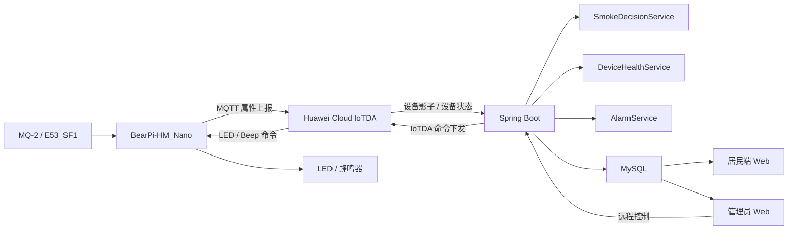

# 智慧烟感安全监控系统

> 一个面向居民与管理员的端云协同智慧烟感系统，围绕“采集—判断—告警—处置—恢复—复盘—反馈”构建完整安全闭环。

本项目以 **BearPi-HM_Nano + E53_SF1（MQ-2 烟雾传感器）** 为边缘设备，通过 **Huawei Cloud IoTDA** 完成设备接入与上下行通信，后端采用 **Spring Boot + MyBatis-Plus + MySQL** 实现数据采集、云端判定、设备健康监测、告警生命周期管理、用户权限与远程控制，前端采用原生 **HTML / CSS / JavaScript** 构建居民端与管理员端深色交互界面。

系统并非只做“烟雾超过固定阈值就报警”，而是将**动态环境基线、持续异常判定、端云协同、设备健康监测、可解释判定、安全优先控制、事件复盘和用户反馈闭环**整合到同一套系统中。

---

## 1. 项目目标

传统烟感系统常见的问题包括：

- 使用单一固定阈值，环境变化时容易出现误报；
- 一旦网络或云端异常，用户难以判断设备是否仍具备本地保护能力；
- 只给出“报警/正常”结果，缺少判定原因；
- 设备在线不等于传感器健康，缺少对数据质量与采集链路的检测；
- 告警通常只是一条记录，缺少确认、恢复和事后复盘；
- 远程控制如果没有安全优先级设计，可能反过来削弱本地报警能力。

因此，本项目将系统设计为一个完整的安全闭环：

```text
MQ-2 实时采样
    ↓
BearPi 边缘快速判断
    ↓
Huawei IoTDA 上报
    ↓
Spring Boot 云端持续性分析
    ↓
风险评分 / 告警生成
    ↓
居民确认 / 管理员处置
    ↓
环境恢复
    ↓
事件复盘
    ↓
用户反馈
    ↓
后续规则与算法优化数据
```

---

## 2. 系统总体架构



### 2.1 四层结构

| 层级 | 技术/组件 | 主要职责 |
|---|---|---|
| 边缘感知层 | BearPi-HM_Nano、E53_SF1、MQ-2、C | 烟雾采样、动态基线、本地预警/报警、LED/蜂鸣器控制 |
| IoT 云接入层 | Huawei Cloud IoTDA、MQTT、Device Shadow | 属性上报、设备在线状态、命令下发 |
| 云端业务层 | Java 17、Spring Boot 2.7.15、Spring Security、JWT、MyBatis-Plus | 数据采集、云端判定、设备健康、告警管理、权限控制、远程控制 |
| 数据与交互层 | MySQL、HTML/CSS/JS | 数据持久化、居民监控、管理员管理、趋势与事件展示 |

---

## 3. 技术栈

### 3.1 边缘端

- BearPi-HM_Nano
- E53_SF1 扩展板
- MQ-2 烟雾传感器
- C
- OpenHarmony / LiteOS 相关组件
- MQTT
- cJSON

### 3.2 云平台

- Huawei Cloud IoTDA
- Device Shadow
- Device Command
- MQTT 设备接入

### 3.3 后端

- Java 17
- Spring Boot 2.7.15
- Spring Web
- Spring Security
- JJWT 0.11.5
- BCrypt
- MyBatis-Plus 3.5.3.1
- MySQL 8.x
- Huawei Cloud IoTDA Java SDK 3.1.47
- Fastjson2 2.0.32
- Lombok
- Spring Scheduled Task

### 3.4 前端

- HTML5
- CSS3
- Vanilla JavaScript
- SVG / Canvas 实时趋势图
- 深色响应式 Dashboard
- JWT Header 自动注入
- 居民端 / 管理员端角色分流

### 3.5 临时公网演示

- cpolar HTTP/HTTPS Tunnel

本地服务仍运行在 `localhost:8080`，cpolar 仅负责将公网访问转发到本地端口，因此不需要改动前后端接口地址。

---

## 4. 端云数据链路

### 4.1 BearPi 上报属性

IoTDA 服务 ID：

```text
Smoke
```

设备会上报以下核心属性：

| 属性 | 含义 |
|---|---|
| `Smoke_Value` | 当前烟雾浓度 |
| `BeepStatus` | 蜂鸣器当前状态 |
| `LedStatus` | LED 当前状态 |
| `Baseline` | BearPi 动态环境基线 |
| `Smoke_Ratio` | 当前烟雾值 / 动态基线 |
| `Smoke_State` | 边缘状态：NORMAL / PREWARNING / ALARM |

Spring Boot 的 `SmokeCollectTask` 每 **3 秒**读取 IoTDA 设备影子，并解析以上属性。

### 4.2 event_time 去重

IoTDA 设备影子可能被重复读取，因此后端不把“读到影子”直接等价为“出现了一条新设备采样”。

系统保存：

```java
lastProcessedEventTime
```

只有 `reported.event_time` 发生变化时，才会：

1. 进入云端烟雾判定；
2. 写入 `smoke_record`；
3. 更新设备最后有效上报时间；
4. 更新设备健康状态；
5. 驱动告警状态机。

如果 `event_time` 没有变化，则不会重复累计异常次数，避免同一条设备影子被重复判定成“连续高值”。

同时仍会检查：

- IoTDA 平台设备状态；
- 数据是否已经超时进入 `STALE`。

这是本系统保证云端时序分析可靠性的一个重要细节。

---

## 5. 创新一：边缘动态基线与本地快速报警

### 5.1 为什么不用单一固定阈值

不同环境的 MQ-2 基础读数不同。如果直接写：

```text
Smoke > 固定阈值 → 报警
```

容易受到环境基线、温度、传感器状态等影响。

因此边缘端首先进行环境基线校准。

### 5.2 基线初始化

设备启动后连续采样：

```text
BASELINE_SAMPLE_COUNT = 30
```

计算平均值作为初始环境基线：

```text
baseline = 30 次烟雾采样平均值
```

随后计算：

```text
Smoke_Ratio = Smoke_Value / Baseline
```

系统判断重点从“绝对值是多少”变成“相对于当前正常环境升高了多少”。

### 5.3 边缘状态阈值

当前边缘策略：

```text
PREWARNING_RATIO = 1.5
ALARM_RATIO      = 2.5
HARD_ALARM_PPM   = 100 ppm
```

逻辑为：

```text
ratio >= 2.5 或 ppm >= 100
    → ALARM
    → LED ON
    → Beep ON

ratio >= 1.5
    → PREWARNING
    → LED ON
    → Beep OFF

其他情况
    → NORMAL
```

### 5.4 正常环境缓慢自适应

仅当烟雾仍接近正常环境时，基线才允许更新：

```text
BASELINE_UPDATE_MAX_RATIO = 1.20
BASELINE_ALPHA            = 0.02
```

更新公式：

```text
baseline_new
= baseline_old × (1 - α)
+ smoke × α
```

这样可以让设备适应长期缓慢的环境漂移，但在明显异常时冻结基线，避免真实烟雾持续升高后被“学习”为新的正常值。

### 5.5 断云仍具备本地安全逻辑

本地烟雾判断和 LED/蜂鸣器控制在 BearPi 上执行，因此算法不依赖 Spring Boot 才能完成本地判断。

需要注意：

> “云端离线”不等于“边缘端一定正常”。如果设备本身断电，本地保护也会停止。因此前端只表达“设备固件具备边缘保护策略”，不会在设备离线时错误保证本地一定仍在运行。

---

## 6. 创新二：云端动态误报抑制与持续异常判定

边缘端负责快速安全响应，云端负责更完整的时间序列分析。

核心实现类：

```text
SmokeDecisionService
```

### 6.1 滑动窗口

```text
WINDOW_SIZE = 5
```

云端保存最近 5 个烟雾值，分析：

- 当前相对背景倍率；
- 连续高值次数；
- 短期上升趋势；
- 当前是否已进入 ALARM；
- 报警后的恢复过程。

### 6.2 云端稳定背景基线

云端也维护自己的背景基线：

```text
BASELINE_UPDATE_MAX_RATIO = 1.20
BASELINE_ALPHA            = 0.02
```

只在 `NORMAL` 且当前值不超过基线 1.2 倍时缓慢更新。

它与边缘基线思想一致，但独立存在，避免直接依赖传感器端单一状态。

### 6.3 WARNING / ALARM 判定

当前云端参数：

```text
WARNING_RATIO = 1.5
ALARM_RATIO   = 2.0
连续异常至少 3 次才正式进入 ALARM
```

规则核心：

```text
ratio >= 2.0
且连续异常 >= 3
→ ALARM
```

如果只是：

```text
单点突然超过 2.0 倍
```

系统只进入 `WARNING`，不会立即生成正式烟雾告警。

如果：

```text
ratio >= 1.5
或最近窗口中出现 >= 3 次明显上升
```

系统进入 `WARNING`。

其中一次“明显上升”要求：

```text
current > previous × 1.05
```

即相邻采样至少增长 5%。

这使系统同时考虑“浓度高度”和“变化趋势”。

### 6.4 风险评分 0~100

云端将判定过程进一步量化成 `riskScore`：

```text
风险评分
= 相对浓度贡献
+ 连续异常贡献
+ 上升趋势贡献
```

当前权重：

```text
相对浓度：最高 50 分
连续异常：最高 30 分
上升趋势：最高 20 分
总分上限：100 分
```

具体计算：

```text
ratioScore = min(max((ratio - 1.0) × 30, 0), 50)
continuousScore = min(consecutiveHigh × 10, 30)
trendScore = min(risingCount × 5, 20)

riskScore = min(ratioScore + continuousScore + trendScore, 100)
```

居民主页将“烟雾报警得分”和实时趋势放在最高信息优先级位置，使用户先看到当前风险，而不是先看到系统技术细节。

### 6.5 报警锁存与恢复迟滞

系统进入 `ALARM` 后不会因为下一条数据略有下降就立即解除。

恢复条件：

```text
RECOVERY_RATIO = 1.30
连续 3 次 <= 背景基线 1.3 倍
→ 才真正恢复 NORMAL
```

这形成了一个简单但有效的迟滞机制：

```text
进入报警：要求持续异常
退出报警：要求持续恢复
```

避免状态在临界点附近反复跳变。

---

## 7. 创新三：端云协同，而不是把所有判断都放到云端

本项目将不同任务分配到不同层：

### 边缘端 BearPi

负责：

- 实时 MQ-2 采样；
- 动态环境基线；
- PREWARNING / ALARM 快速判定；
- LED / 蜂鸣器本地执行；
- 云端失联时仍保留设备固件内的本地判断能力。

### 云端 Spring Boot

负责：

- 持续性时间序列分析；
- 单点尖峰过滤；
- 风险评分；
- 告警生命周期；
- 设备健康判断；
- 用户权限和数据隔离；
- 事件复盘与反馈；
- 管理员远程控制。

因此系统不是：

```text
传感器 → 云端 → 云端决定一切
```

而是：

```text
边缘快速安全响应
+
云端持续分析与管理
```

---

## 8. 创新四：设备健康监测，而不只看“在线/离线”

核心实现：

```text
DeviceHealthService
DeviceInsightController
```

设备状态分为：

```text
NORMAL
STALE
OFFLINE
SENSOR_FAULT
```

### 8.1 STALE：设备看似存在，但数据已经不新鲜

BearPi 正常情况下约每 3 秒上报一次。

如果：

```text
超过 15 秒没有新的 event_time
```

则：

```text
health_status = STALE
```

这解决了一个常见问题：

> IoT 平台连接状态没有立刻变成 OFFLINE，但业务层已经长时间没有收到新数据。

### 8.2 OFFLINE：平台状态与连续通信失败

Spring Boot 会查询 IoTDA 的真实设备状态，并结合后端到 IoTDA 的通信结果更新设备健康。

连续通信失败阈值：

```text
3 次
```

系统不会因为一次 SDK 请求失败就直接断言 BearPi 离线。

### 8.3 SENSOR_FAULT：设备在线，但数据本身不可信

设备仍在上报并不代表传感器一定健康。

系统会检查：

1. `Smoke_Value` 是否为空、NaN、Infinity 或负数；
2. `Baseline` 是否为空、非法或 <= 0；
3. `Smoke_Ratio` 是否为空、非法或负数；
4. 云端重新计算 `smoke / baseline`，与边缘上报倍率做一致性校验；
5. `Smoke_State` 是否属于 `NORMAL / PREWARNING / ALARM`。

倍率一致性容差：

```text
max(0.15, expectedRatio × 20%)
```

若异常，则：

```text
health_status = SENSOR_FAULT
```

### 8.4 故障恢复也要求连续正常

从 `SENSOR_FAULT` 恢复时，不会因为出现一条正常数据就立即恢复。

当前要求：

```text
连续 3 次健康检查正常
→ SENSOR_FAULT → NORMAL
```

这与烟雾报警恢复策略保持一致：状态切换需要持续证据，而不是依赖单点数据。

---

## 9. 创新五：设备健康指数与数据可信度

除了离散的健康状态，系统还提供面向用户的透明评分。

### 9.1 设备健康指数

接口：

```text
GET /api/device/{deviceId}/insight
```

评分由三部分组成：

```text
Network    35%
Sensor     40%
Freshness  25%
```

并根据连续通信失败增加惩罚项。

当前数据新鲜度评分示例：

```text
<= 10 秒   → 100
<= 30 秒   → 82
<= 120 秒  → 55
> 120 秒   → 25
```

综合得分输出：

```text
Excellent
Healthy
Attention
Needs inspection
```

同时返回明确维护建议，例如：

- 检查设备供电、Wi-Fi 或 IoTDA 连接；
- 检查 MQ-2 传感器连接与采样状态；
- 数据新鲜度下降，建议检查上报链路；
- 近期存在连续通信失败。

这是一套**透明规则评分**，项目不会将其包装成未经训练的“AI 故障预测模型”。

### 9.2 数据可信度

居民端将设备连接、数据新鲜度和传感器状态进一步组合为“数据可信度”展示，使用户不仅看到一个烟雾数值，还能理解：

> 当前这个数值是否值得信任。

---

## 10. 创新六：告警生命周期不是一条孤立记录

核心表：

```text
alarm
```

告警状态由两个维度共同描述：

### 人工确认

```text
acknowledged = 0 / 1
ack_time
```

表示用户是否已经收到并确认告警。

### 环境恢复

```text
recover_time
```

表示烟雾环境是否已经恢复。

这两个概念严格分离：

```text
“有人确认了” ≠ “烟雾已经恢复”
```

### 10.1 防止重复告警

当云端持续处于 `ALARM` 时，系统会先查询：

```text
同一设备
alarm_type = SMOKE
recover_time IS NULL
```

如果已经存在活动告警，则不会重复插入。

### 10.2 自动闭环

当云端从 `ALARM` 恢复到 `NORMAL`：

```text
recover_time = 当前时间
```

因此一条完整安全事件可以形成：

```text
异常发生
→ 告警生成
→ 用户确认
→ 环境恢复
→ 事件闭环
```

---

## 11. 创新七：事件复盘

系统不是只把历史告警留在数据库，而是把一次告警转化为可理解的“安全事件”。

接口：

```text
GET /api/alarm/{id}/review
```

系统围绕告警时间前后额外读取约 30 秒上下文，并自动统计：

- 事件持续时间；
- 人工响应时间；
- 峰值烟雾浓度；
- 峰值倍率；
- 最高风险评分；
- WARNING 样本数量；
- ALARM 样本数量；
- 第一次进入 WARNING 的时间；
- 第一次出现 ALARM 样本的时间；
- 事件时间线。

最终可以展示为：

```text
发现异常趋势
    ↓
持续异常被确认为安全事件
    ↓
用户确认收到告警
    ↓
环境恢复正常
```

相比单纯展示一行 SQL 记录，这种表达更符合真实安全事件的处理逻辑。

---

## 12. 创新八：用户反馈闭环

系统增加独立表：

```text
alarm_feedback
```

一次闭环事件结束后，居民可反馈实际场景：

```text
REAL_SMOKE   真实烟雾 / 火情
COOKING      烹饪烟雾
SMOKING      香烟
STEAM        蒸汽
FALSE_ALARM  未发现异常
UNKNOWN      无法确认
```

接口：

```text
POST /api/alarm/{id}/feedback
```

管理员可查看反馈统计：

```text
GET /api/admin/experience/feedback-summary
```

### 为什么反馈不会直接自动降低报警阈值

项目当前没有设计成：

```text
用户说“这是做饭”
→ 系统自动降低下一次报警灵敏度
```

因为这可能带来安全风险。

当前反馈主要作为：

- 误报分析数据；
- 场景统计；
- 后续规则优化依据；
- 后续机器学习训练数据来源。

即：

```text
用户反馈
→ 数据沉淀
→ 管理员分析
→ 后续算法优化
```

而不是直接改变安全底线。

---

## 13. 创新九：管理员远程控制 + 边缘安全优先级

管理员可以远程控制真实设备：

```text
LED ON / OFF
BEEP ON / OFF
```

接口：

```text
POST /api/admin/devices/{deviceId}/command
```

请求示例：

```json
{
  "target": "LED",
  "state": "ON"
}
```

或：

```json
{
  "target": "BEEP",
  "state": "OFF"
}
```

后端通过 Huawei IoTDA SDK 下发命令：

```text
Service ID: Smoke

Smoke_Control_LED
  └─ LED: ON / OFF

Smoke_Control_Beep
  └─ Beep: ON / OFF
```

### 13.1 手动控制为什么不会再“一秒后被自动逻辑关掉”

BearPi 固件增加：

```text
manual_led_enabled
manual_led_value
manual_beep_enabled
manual_beep_value
```

管理员操作后，正常环境下保持手动状态，不会被下一轮 `Smoke_AutoControl()` 立刻覆盖。

### 13.2 Safety Override：危险状态拥有最高优先级

最终输出不是简单“谁最后写 GPIO 谁生效”，而是按优先级执行：

```text
最高优先级：真实 SMOKE_ALARM
    → LED 强制 ON
    → Beep 强制 ON

第二优先级：管理员手动控制

第三优先级：普通自动控制
```

因此，即使管理员此前手动关闭了蜂鸣器，只要边缘端进入真实高危 `ALARM`，设备仍会重新强制开启声光报警。

这保证了：

> 远程管理能力不能突破设备的本地安全底线。

---

## 14. 用户体系与安全认证

### 14.1 角色

当前两类角色：

```text
resident  居民
admin     管理员
```

### 14.2 密码

密码使用：

```text
BCryptPasswordEncoder
```

数据库不保存用户明文密码。

系统还保留对早期开发阶段明文密码的兼容迁移逻辑：旧账号首次成功登录后可自动升级为 BCrypt 哈希。

### 14.3 JWT

登录成功后生成 JWT，写入：

```text
userId
username
role
```

浏览器后续请求统一携带：

```http
Authorization: Bearer <JWT>
```

JWT 默认有效期：

```text
24 小时
```

### 14.4 Spring Security

公开：

```text
/api/auth/login
/api/auth/register
静态页面和静态资源
```

仅管理员：

```text
/api/admin/**
/api/test/**
```

其他业务 API：

```text
必须登录
```

未登录返回：

```text
401 Unauthorized
```

无权限返回：

```text
403 Forbidden
```

---

## 15. 居民房间级数据隔离

核心实现：

```text
DataScopeService
```

管理员：

```text
可查看全部设备、记录和告警
```

居民：

```text
仅能访问与自己绑定的设备
或与本人 building / floor / room 匹配的设备
```

可见设备范围会进一步用于限制：

- `/api/device/list`
- `/latest`
- `/history`
- `/api/alarm/list`
- `/api/alarm/{id}`
- `/api/alarm/{id}/handle`
- `/api/alarm/{id}/review`
- `/api/device/{deviceId}/insight`

因此权限不是只在前端隐藏按钮，而是在后端真正限制数据查询。

系统已经通过两个居民位于不同房间的方式验证：没有对应设备的居民不会看到其他房间的烟雾数据和告警。

---

## 16. 管理员功能

管理员控制台包括：

### 系统总览

- 设备总数；
- 在线设备数；
- 健康异常设备；
- 活动烟雾告警；
- 待人工确认；
- 居民数量；
- 最新烟雾与风险状态；
- 设备可信度与健康指数；
- 最近安全事件；
- 用户反馈统计。

### 用户管理

- 新增居民/管理员；
- 编辑用户；
- 修改楼栋、楼层、房间、手机号、管理员工号；
- 重置密码；
- 删除测试/无效账号；
- 禁止管理员删除当前正在使用的自己账号。

### 设备管理

- 查看设备连接与健康状态；
- 编辑设备位置；
- 绑定居民；
- 解除居民绑定；
- 在线设备远程控制 LED / 蜂鸣器。

### 告警管理

- 查看全部烟雾告警；
- 活动/已恢复筛选；
- 待确认/已确认筛选；
- 按位置、设备、原因查询；
- 管理员确认告警。

### 监测记录

- 查看烟雾历史；
- 按设备筛选；
- 按 NORMAL / WARNING / ALARM 筛选；
- 查看边缘状态、基线、倍率、云端状态、风险评分、判定原因。

---

## 17. 居民端信息设计

居民端不以“技术展示”为目标，而是优先回答用户最关心的问题。

当前信息优先级：

1. **烟雾报警得分 0~100**
2. **实时烟雾趋势**
3. 当前烟雾浓度
4. 当前风险状态
5. 设备连接与健康状态
6. 数据可信度
7. 保护模式
8. 当前判定依据
9. 最近安全事件
10. 设备健康指数
11. 事件复盘与反馈

趋势图保留真实采样间隔语义：如果相邻记录间隔超过约 10 秒，曲线断开，而不是强行连接，避免用户误以为中间一直有连续采样。

---

## 18. 数据库设计

### 18.1 `sys_user`

核心字段：

```text
id
username
role
building
floor
room
phone
job_num
password
```

### 18.2 `device`

```text
device_id
building
floor
room
status
user_id
health_status
last_report_time
consecutive_failures
```

### 18.3 `smoke_record`

```text
id
device_id
collect_time
smoke_concentration
alarm
edge_state
edge_baseline
smoke_ratio
cloud_state
risk_score
decision_reason
```

这张表同时保留“边缘判断”和“云端判断”，便于后续对比分析。

### 18.4 `alarm`

```text
id
device_id
alarm_time
location
acknowledged
ack_time
alarm_type
alarm_level
reason
recover_time
```

### 18.5 `alarm_feedback`

```text
id
alarm_id
user_id
feedback_type
feedback_note
feedback_time
```

`alarm_feedback` 使用独立表，避免修改已有告警主表语义。

---

## 19. 核心 API

### 认证

```text
POST /api/auth/login
POST /api/auth/register
GET  /api/auth/me
```

### 居民/通用数据

```text
GET  /latest
GET  /history
GET  /api/device/list
GET  /api/device/{deviceId}/insight
GET  /api/alarm/list
GET  /api/alarm/{id}
POST /api/alarm/{id}/handle
GET  /api/alarm/{id}/review
POST /api/alarm/{id}/feedback
```

### 管理员

```text
GET    /api/admin/overview
GET    /api/admin/devices
PUT    /api/admin/devices/{id}
POST   /api/admin/devices/{deviceId}/command

GET    /api/admin/users
POST   /api/admin/users
PUT    /api/admin/users/{id}
PUT    /api/admin/users/{id}/password
DELETE /api/admin/users/{id}

GET    /api/admin/alarms
GET    /api/admin/records
GET    /api/admin/experience/feedback-summary
```

### 开发测试接口

```text
GET /api/test/smoke
GET /api/test/health/sensor
```

测试接口仅管理员可访问，正式部署时建议进一步通过 Spring Profile 限制或关闭。

---

## 20. 关键代码结构

```text
src/main/java/com/example/demo
├─ controller
│  ├─ AuthController
│  ├─ SmokeController
│  ├─ DeviceController
│  ├─ DeviceInsightController
│  ├─ AlarmController
│  ├─ AlarmActionController
│  ├─ AdminOverviewController
│  ├─ AdminDeviceController
│  ├─ AdminDeviceCommandController
│  ├─ AdminAlarmController
│  ├─ AdminRecordController
│  └─ UserController
│
├─ service
│  ├─ SmokeDecisionService
│  ├─ DeviceHealthService
│  ├─ AlarmService
│  ├─ AlarmExperienceService
│  ├─ AuthService
│  └─ DataScopeService
│
├─ task
│  └─ SmokeCollectTask
│
├─ security
│  ├─ JwtUtil
│  ├─ JwtAuthenticationFilter
│  ├─ SecurityConfig
│  └─ PasswordConfig
│
├─ iot
│  └─ IotConfig
│
├─ entity
├─ mapper
├─ dto
└─ vo
```

前端：

```text
src/main/resources/static
├─ login.html
├─ index.html
├─ admin.html
├─ technical.html
├─ css/
│  └─ v5.css
└─ js/
   ├─ auth.js
   └─ v5-motion.js
```

---

## 21. 本地运行

### 21.1 环境要求

```text
JDK 17
Maven
MySQL 8.x
Spring Boot 2.7.15
```

### 21.2 数据库

创建数据库：

```sql
CREATE DATABASE smoke_db
CHARACTER SET utf8mb4;
```

确保已有核心业务表：

```text
sys_user
device
smoke_record
alarm
```

系统启动时会自动确保用户反馈表存在：

```text
alarm_feedback
```

### 21.3 配置

不要把数据库密码、JWT Secret、IoTDA AK/SK、设备密钥直接提交到公开 GitHub。

推荐将 `application.yml` 改为环境变量形式，例如：

```yaml
spring:
  datasource:
    url: ${DB_URL}
    username: ${DB_USERNAME}
    password: ${DB_PASSWORD}

jwt:
  secret: ${JWT_SECRET}
  expiration: 86400000

huawei:
  iot:
    ak: ${HUAWEI_IOT_AK}
    sk: ${HUAWEI_IOT_SK}
    regionId: ${HUAWEI_IOT_REGION}
    endpoint: ${HUAWEI_IOT_ENDPOINT}
    deviceId: ${HUAWEI_IOT_DEVICE_ID}
    projectId: ${HUAWEI_IOT_PROJECT_ID}
```

> 如果开发阶段的密钥曾经出现在源码、截图或公开仓库中，正式发布前应进行轮换。

### 21.4 启动

IDEA 直接运行：

```text
DemoApplication
```

浏览器访问：

```text
http://localhost:8080/login.html
```

登录后：

```text
resident → index.html
admin    → admin.html
```

---

## 22. 临时公网演示

项目本地运行在 8080 端口时，可以使用 cpolar：

```bash
cpolar http 8080
```

成功后会出现：

```text
Forwarding https://xxxx.cpolar.* -> http://localhost:8080
```

对外分享：

```text
https://xxxx.cpolar.*/login.html
```

注意：

- 免费隧道重新启动后 URL 可能变化；
- MySQL、Spring Boot、cpolar、电脑网络必须保持运行；
- 电脑不能进入睡眠；
- cpolar 仅适合短期演示，不建议作为正式生产部署。

---

## 23. 当前系统的核心创新总结

| 创新点 | 传统做法 | 本项目实现 |
|---|---|---|
| 动态误报抑制 | 单阈值报警 | 动态基线 + 滑动窗口 + 连续高值 + 上升趋势 |
| 端云协同 | 所有判断依赖云端 | BearPi 快速本地判断 + Spring Boot 持续分析 |
| 报警迟滞 | 一降下来立即解除 | 连续 3 次恢复正常后解除 |
| 单点尖峰抑制 | 单次超阈值即火警 | 单点高值先 WARNING，持续异常才 ALARM |
| 设备健康 | 只看在线/离线 | NORMAL / STALE / OFFLINE / SENSOR_FAULT |
| 数据自校验 | 信任设备所有上报 | 云端重新计算 ratio 并校验一致性 |
| 可解释判定 | 只给报警结果 | riskScore + decisionReason + 事件时间线 |
| 数据可信度 | 数值默认可信 | 连接、传感器、数据新鲜度联合展示 |
| 安全远程控制 | 手动命令覆盖一切 | 真实 ALARM 拥有最高输出优先级 |
| 告警闭环 | 一条告警记录 | 触发 → 确认 → 恢复 → 复盘 → 用户反馈 |
| 居民数据隔离 | 前端隐藏数据 | 后端 DataScopeService 房间/设备级鉴权 |
| 用户反馈 | 系统单向判断 | 事件后反馈沉淀为后续误报优化数据 |

---

## 24. 已验证的关键链路

项目开发过程中已实际验证：

```text
BearPi → IoTDA → Spring Boot → MySQL
```

```text
管理员 Web → Spring Boot → IoTDA → BearPi → LED
```

以及：

```text
管理员远程 LED 开 → LED 可持续常亮
管理员远程 LED 关 → LED 熄灭
管理员远程蜂鸣器开/关 → 设备执行
```

同时验证了：

- JWT 无 Token 请求业务接口返回 401；
- 合法 JWT 可访问授权接口；
- resident 无法调用管理员/测试接口，返回 403；
- 不同房间居民之间的数据隔离；
- 告警生成、人工确认、环境恢复三个时间点独立记录；
- 设备 OFFLINE / STALE / SENSOR_FAULT 状态链路；
- 远程手动控制不会被 NORMAL 自动逻辑立即覆盖；
- 真实 ALARM 仍可覆盖人工关闭状态，保持安全优先。

---

## 25. 当前限制

当前项目仍属于持续迭代中的工程原型，主要限制包括：

1. 当前真实硬件主要对应一台 BearPi，数据库设备 ID 与 IoTDA 真实设备映射仍采用单设备配置方式；
2. 用户反馈目前用于统计和后续优化数据沉淀，尚未自动驱动个性化模型；
3. 当前烟雾判定属于透明规则与时序策略，不应表述为训练完成的机器学习模型；
4. cpolar 仅用于短期公网演示；
5. 正式部署前需要进一步完成密钥环境变量化、HTTPS、生产数据库与日志审计；
6. 后续可以继续扩展短信/消息通知、多设备联动、设备预测性维护和更丰富的告警等级。

---

## 26. 后续可扩展方向

- 多 BearPi / 多房间设备管理；
- 设备 ID 与 IoTDA Device ID 正式映射表；
- WebSocket / SSE 实时推送，减少轮询；
- 短信、微信、邮件告警通知；
- 基于用户反馈的数据集构建；
- 烹饪烟雾、蒸汽、香烟等场景分类；
- 设备故障趋势预测；
- 多传感器 / 多设备协同判定；
- Docker + Nginx + 云服务器正式部署；
- 审计日志与管理员操作追踪；
- 更完善的单元测试、集成测试和 UAT。

---

## 27. 一句话概括

> 这不是一个“烟雾超过阈值就响”的简单 IoT Demo，而是一套将边缘快速响应、云端持续分析、设备健康、权限隔离、远程控制、安全优先和事件闭环整合到一起的智慧烟感系统。

